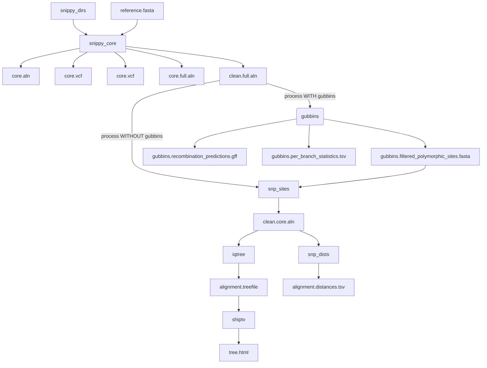

# Snippy Phylogenomics

Core SNPs are identified by `snippy-core`. [`gubbins`](https://github.com/nickjcroucher/gubbins) is used to identify and filter recombinant loci.




Note: the process WITHOUT gubbins occurs if --skip_gubbins is true, or if there are only two samples input as gubbins requires a minimum of 3 samples.

## Inputs

- `--snippy_dirs`:
- `--ref`: A reference `.fasta` file

## Usage

```
nextflow run BCCDC-PHL/snippy-phylogenomics-nf \
  --snippy_dirs </path/to/snippy_output_dirs> \
  --ref ref.fa \
  [--mask mask.bed] \
  --outdir outdir
```

## Outputs


