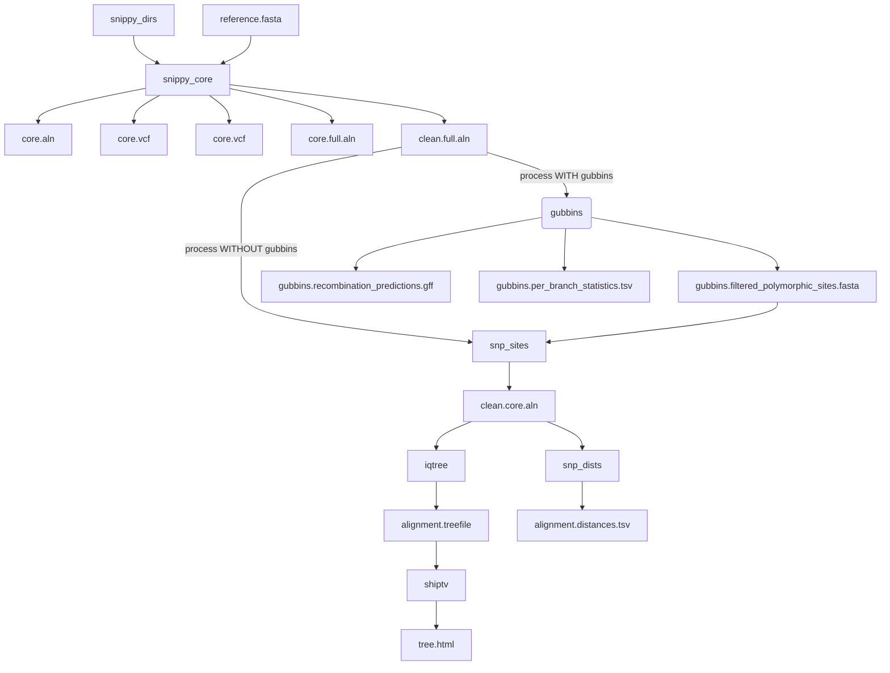

[](https://github.com/BCCDC-PHL/snippy-core-phylogenomics/actions/workflows/tests.yml)

# Snippy Phylogenomics

Core SNPs are identified by `snippy-core`. [`gubbins`](https://github.com/nickjcroucher/gubbins) is used to identify and filter recombinant loci.




Note: the process WITHOUT gubbins occurs if --skip_gubbins is true. This parameter should be used when your input has only 2 samples as gubbins requires a minimum of 3 samples.

## Inputs

- `--snippy_dirs`:
- `--ref`: A reference `.fasta` file

## Usage

```
nextflow run BCCDC-PHL/snippy-core-phylogenomics \
  --snippy_dirs </path/to/snippy_output_dirs> \
  --ref ref.fa \
  [--mask mask.bed] \
  --outdir outdir
```

## Outputs

## Provenance

In the output directory, a provenance file will be written with the following format:

```
- pipeline_name: BCCDC-PHL/snippy-core-phylogenomics
  pipeline_version: 0.1.2
  nextflow_session_id: 15245f59-7acc-4a0d-88ee-2232ddad329f
  nextflow_run_name: zen_goldwasser
  timestamp_analysis_start: 2024-11-21T14:59:18.014789-08:00
- process_name: snippy_core
  tools:
    - tool_name: snippy_core
      tool_version: 4.6.0
      parameters:
        - parameter: --ref
          value: H37Rv_NC000962.3.fasta
        - parameter: --mask
          value: mask.bed
- process_name: gubbins
  tools:
    - tool_name: gubbins
      tool_version: 3.3.1
      parameters:
        - parameter: --threads
          value: 8
        - parameter: -p
          value: gubbins
- process_name: snp_sites
  tools:
    - tool_name: snp_sites
      tool_version: 2.5.1
      parameters:
        - parameter: -c
          value: gubbins.filtered_polymorphic_sites.fasta
- process_name: iqtree
  tools:
    - tool_name: iqtree
      tool_version: 2.3.6
      parameters:
        - parameter: -nt
          value: 16
        - parameter: -fconst
          value: 0,0,0,0
        - parameter: -s
          value: clean.core.aln
        - parameter: -st
          value: DNA
        - parameter: -m
          value: GTR+G
- process_name: shiptv
  tools:
    - tool_name: shiptv
      tool_version: 0.4.1
      parameters:
        - parameter: -n
          value: clean.core.aln.treefile
        - parameter: -0
          value: clean.core.aln.treefile.html

```